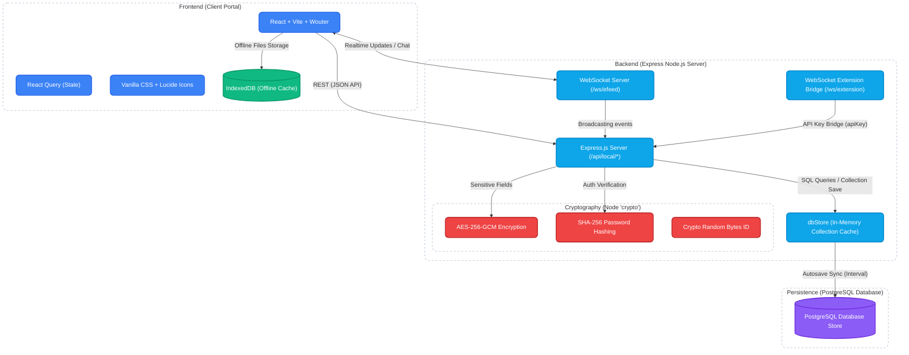
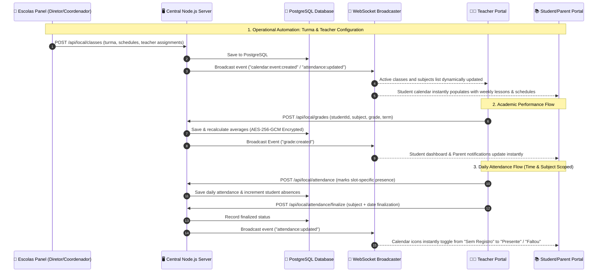
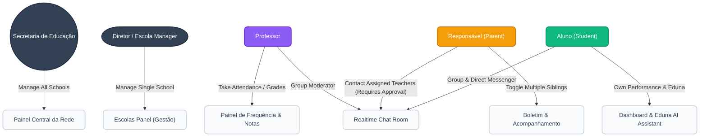
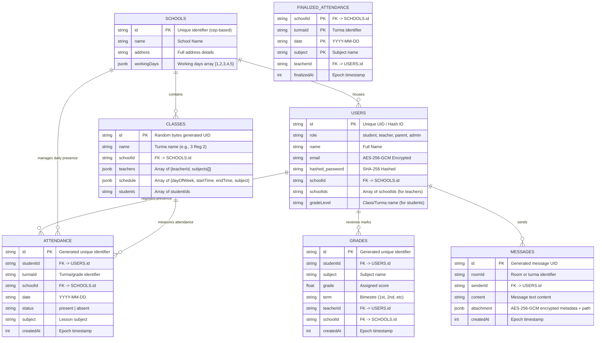
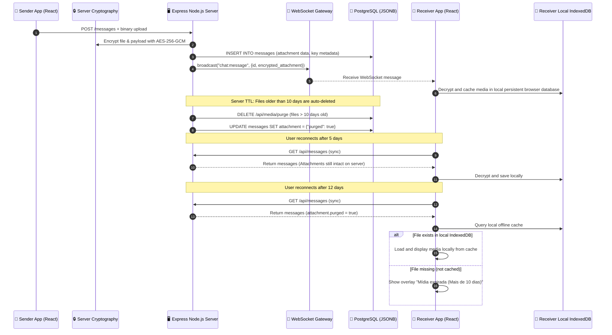
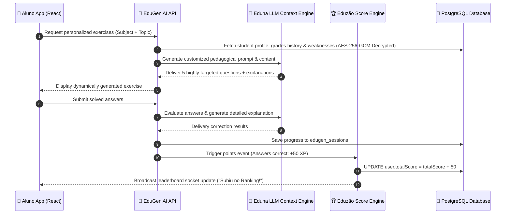

# 🏛️ EduTok Complete System Architecture

This document provides a production-grade map of the entire EduTok platform. It covers the frontend layers, backend services, **PostgreSQL** database schemas, cryptographic implementations, user roles, APIs, and the operational flows between the Student/Teacher portal and the **Escolas Panel**.

---

## 1. High-Level Component & Crypto Architecture
This diagram outlines the complete technology stack, specific encryption algorithms, and how the React frontend interfaces with the Express Node.js Server and PostgreSQL persistence layer.

---

## 2. Operational Integration Flow: Central Portal & Escolas Panel
The relationship between the administrative **Escolas Panel** (School Management) and the Student/Teacher/Parent panels. Because both panels consume the same backend API and share a single PostgreSQL persistent store, any administrative change flows instantly down to the portal.

---

## 3. User Roles & Access Hierarchy
EduTok utilizes five strict user roles, granting or restricting access to specific application panels.

---

## 4. Production PostgreSQL Database Schema (ERD)
An Entity-Relationship Diagram mapping the core relational tables in the PostgreSQL database.

---

## 5. Ephemeral Media & WhatsApp-Style 10-Day Retention Flow
This sequence diagram details how media (images/documents/videos) are uploaded, securely encrypted using **AES-256-GCM**, cached offline in the client, and purged automatically on the central server after 10 days to guarantee privacy and fast recovery.

---

## 6. EduGen & AI Tutor Scoring Pipeline (Eduzão Leaderboard)
The gamification loop: how student AI interactions dynamically feed the municipal scoreboard.

