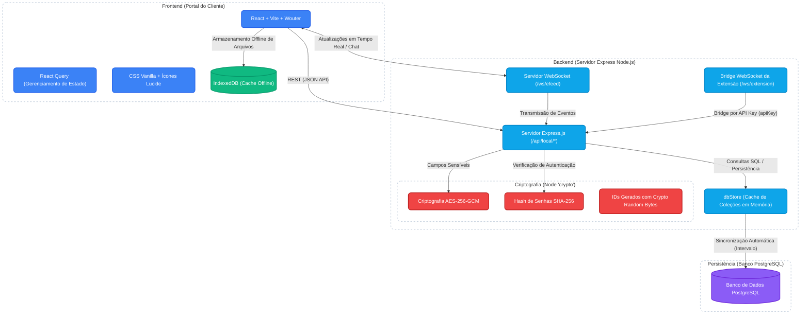
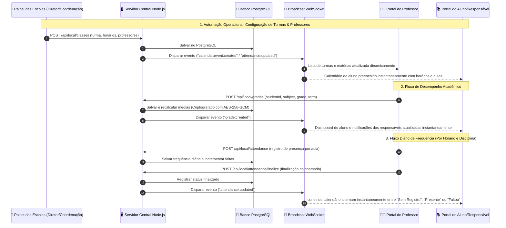
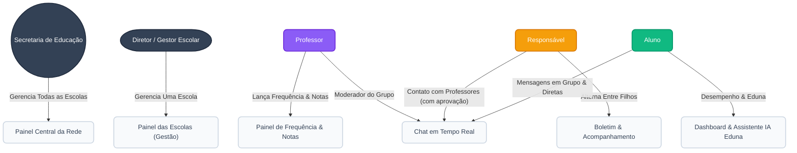
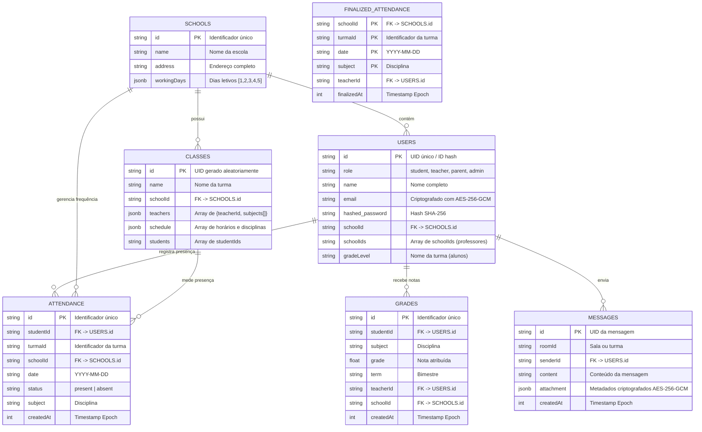
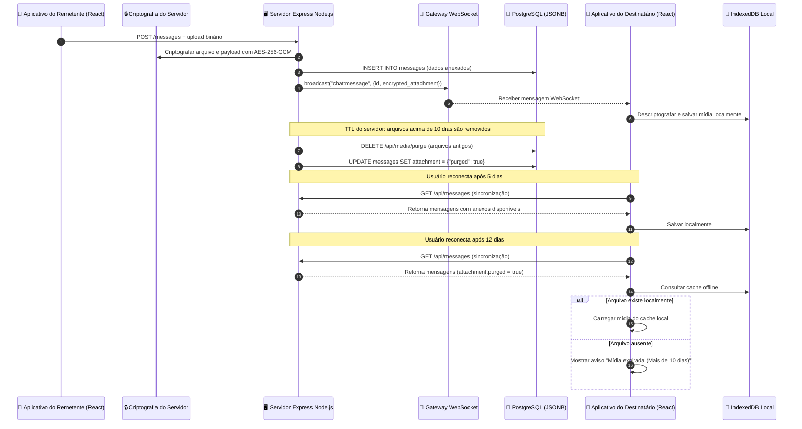
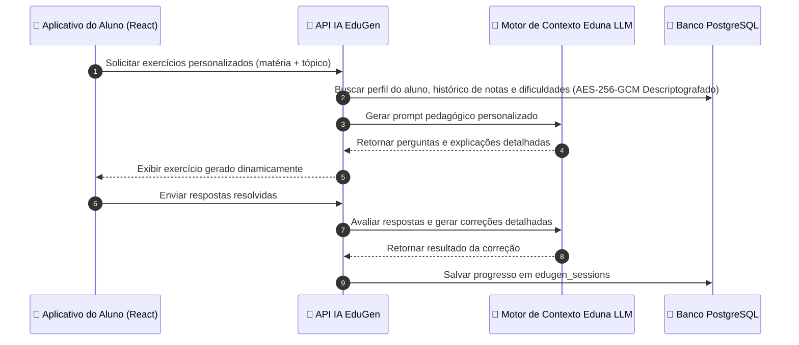

# 🏛️ Arquitetura Completa do Sistema EduTok

Este documento apresenta um mapa técnico de nível profissional de toda a plataforma **EduTok**. Ele cobre as camadas de frontend, serviços backend, esquemas do banco de dados **PostgreSQL**, implementações criptográficas, papéis de usuários, APIs e os fluxos operacionais entre o portal de Alunos/Professores e o **Painel das Escolas**.

---

## 1. Arquitetura de Alto Nível dos Componentes & Criptografia

Este diagrama demonstra toda a stack tecnológica da plataforma, os algoritmos específicos de criptografia e como o frontend em React se comunica com o servidor Express Node.js e com a camada de persistência PostgreSQL.

---

## 2. Fluxo de Integração Operacional: Portal Central & Painel das Escolas

A relação entre o **Painel das Escolas** (gestão administrativa) e os painéis de alunos, professores e responsáveis. Como todos os ambientes utilizam a mesma API backend e compartilham o mesmo banco PostgreSQL, qualquer alteração administrativa é refletida instantaneamente nos portais.

---

## 3. Papéis de Usuário & Hierarquia de Acesso

O EduTok utiliza cinco níveis rigorosos de permissões, garantindo que cada usuário acesse apenas os recursos adequados ao seu papel.

---

## 4. Estrutura do Banco PostgreSQL (ERD)

Diagrama Entidade-Relacionamento representando as principais tabelas relacionais do banco PostgreSQL.

---

## 5. Fluxo de Retenção de Mídia Temporária (10 Dias)

Este diagrama mostra como imagens, documentos e vídeos são enviados, criptografados com **AES-256-GCM**, armazenados offline no navegador e removidos automaticamente do servidor após 10 dias.

---

## 6. Pipeline do EduGen & Tutor Inteligente

Fluxo operacional do sistema de geração de exercícios personalizados com IA da plataforma EduTok.

