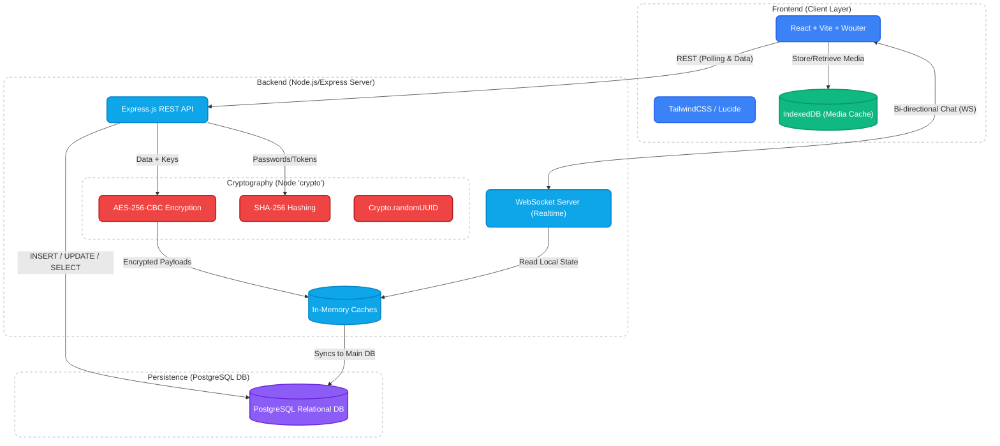
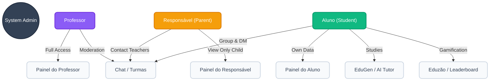
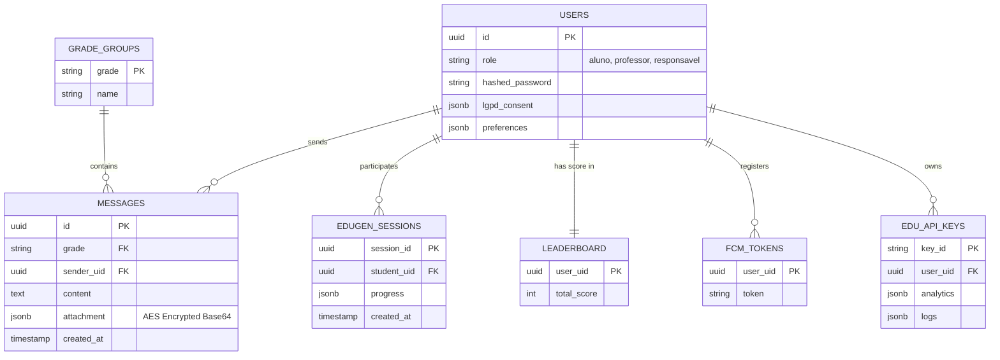
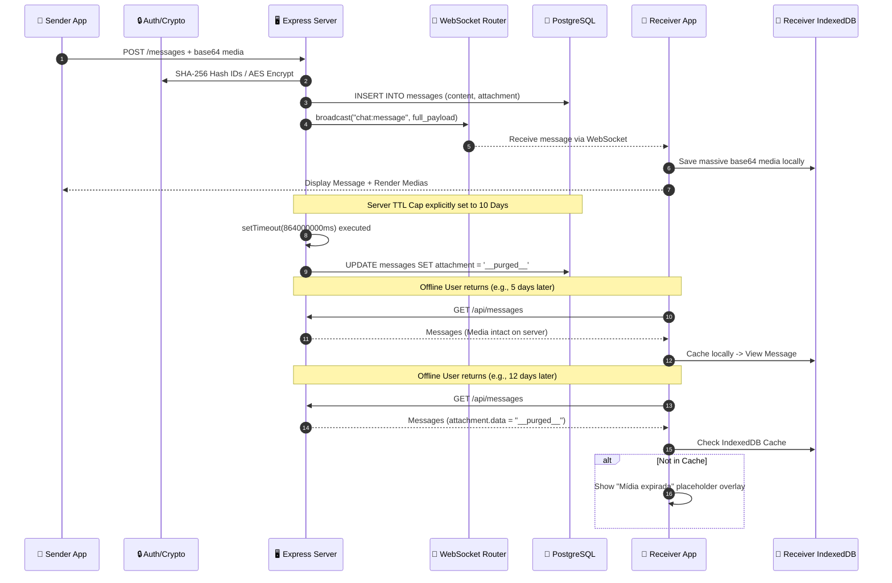
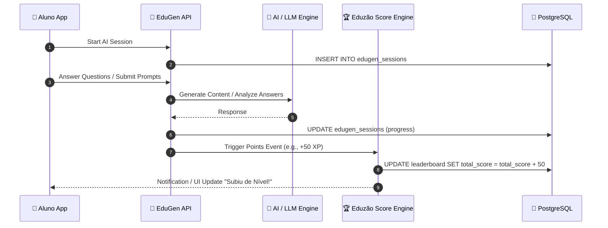

# 🏛️ EduTok Complete System Architecture

This document provides a highly detailed map of the entire EduTok platform. It covers the frontend layers, backend services, **PostgreSQL** database schemas, cryptographic implementations, user roles, APIs, and the Ephemeral Media Chat system.

---

## 1. High-Level Component & Crypto Architecture
This diagram outlines the complete technology stack, specific encryption algorithms, and how the React frontend interfaces with the Express Node.js Server and PostgreSQL layer.

---

## 2. User Roles & Access Hierarchy
EduTok utilizes three strict user roles, granting or restricting access to specific application panels.

---

## 3. PostgreSQL Database Schema (ERD)
An Entity-Relationship Diagram mapping the core relational tables in the PostgreSQL database.

---

## 4. Complete Application Flow: Ephemeral Media & Chat
This details the step-by-step lifecycle of sending media (images/documents/videos), distributing it, and securely pruning it via the WhatsApp-style 10-day retention model to support offline delivery.

---

## 5. EduGen (AI Module) & Leaderboard Flow
The flow of how students interact with the AI Tutor and how actions generate points for the Eduzão gamification ladder.

